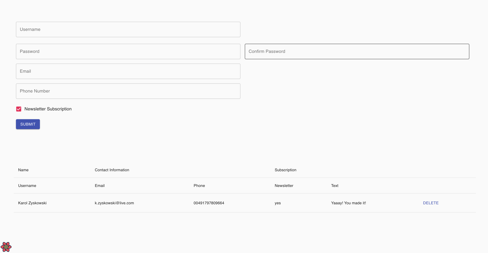

# React TypeScript Registration Form (Coding Challenge)

Here is a link to the live version: [https://karoldavid.github.io/react-ts-registration-form/](https://karoldavid.github.io/react-ts-registration-form/).

## Getting Started

### Prerequisites

Make sure you have Node v14 or later and npm installed.

### Installing

1. Clone or download the repository.
2. `cd` into the project directory.
3. Run `npm install` to install the npm packages locally.
4. Run `npm start` to run the app. The app should open automatically in a web browser.

## Built With

* [Create React App TypeScript](https://github.com/facebook/create-react-app)
* [React Hook Form](https://react-hook-form.com)
* [Yup Schema Validation](https://github.com/jquense/yup)
* [Material UI](https://mui.com/)
* [React Query](https://react-query.tanstack.com)
* [React Table](https://react-table.tanstack.com/)
* [Mock API](https://mockapi.io/)

## Author

* **Karol Zyskowski**

Questions? Send an email to: k.zysk@zoho.com

## License

This project is licensed under the MIT License - see the
[LICENSE.md](LICENSE.md) file for details

